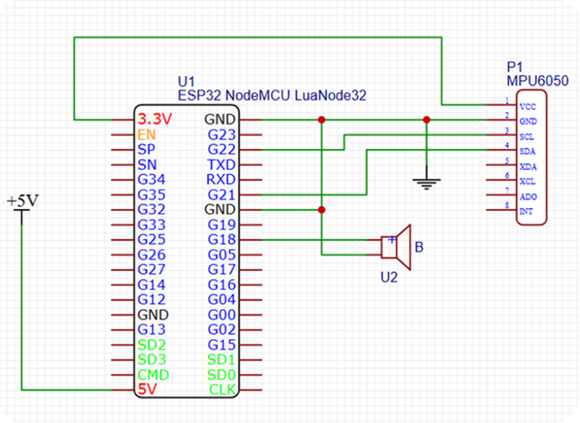
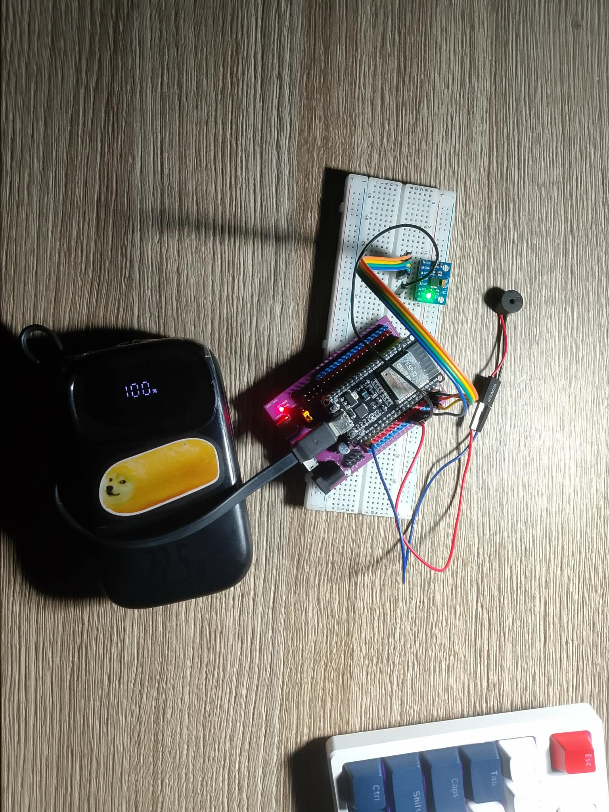
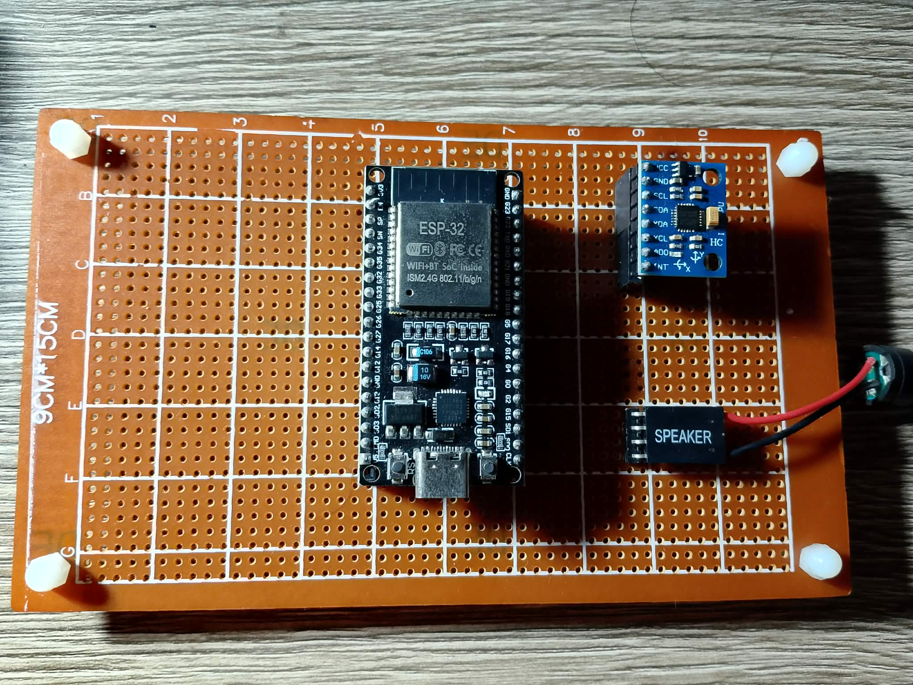

# GPS TRACKER


A GPS tracking IoT system built on ESP32, combining location data with accelerometer-based motion sensing to estimate motion dynamics such as acceleration and tilt angle. Built with PlatformIO.

This is a firmware part of the project.

## 🪧 Repository Overview
- `include/ `: header files
- `src/`: main functions and main script
- `test/`: test in native enviroment
- `platformio.ini` environment config and dependencies.

## ✨ Features
- **Location tracking**: Estimates device location by scanning nearby WiFi MAC addresses and signal strength.
- **Motion sensing**: Uses an accelerometer to analyze movement and tilt angle.
- **Cloud integration**: Stores data in a real-time database.
- **Device reponse**: Uses a buzzer to help physically locate the device.
- **WiFi Manager**: Provides a captive portal for easy WiFi configuration and automatic reconnection.
- **Low-power Consumption**: System "sleeps" when no movement. 

## ⛏️ System Architecture
### ■ System requirements
- **Hardware**:
    - ESP32 board
    - Accelerometer *e.g MPU6050*
    - Buzzer
- **Cloud**: Configured real-time database
- **Network**: proper WiFi connection
- **APIs**: Database API and Geolocation API
### ■ System flow
The system is built around an ESP32 as the core controller. It collects data from an accelerometer for motion and tilt analysis, and performs WiFi scanning to estimate location.

The processed data is transmitted to a cloud-based real-time database via WiFi. Users can monitor device status remotely and trigger actions such as activating the buzzer for physical localization.

A WiFi captive portal is used for network configuration and ensures stable connectivity.
### ■ Schematic


| Pin | Connect | 
|----------|-----------|
| 3V3 | MPU VCC & B+ |
| GND | GND & B- |
| 22 | SCL |
| 21 | SDA |

## 🔗 Dependencies
- Library: `platformio.ini`
```
lib_deps =
    mobizt/Firebase ESP Client
    tzapu/WiFiManager
    bblanchon/ArduinoJson
```
- Firebase Database
- HERE Geolocation API
## ⚙️ Configuration
### PlatformIO
Make sure to have PlatformIO extension
### WiFi Manager
On first boot or when it cannot connect to a saved network, 
ESP32 creates a WiFi access point and launches a captive portal.
Dont have to config in firmware.<br>
Connect to ESP network and connect to suitable WiFi, then ESP will reconnect. <br>
In case there is no portal opened, RESET ESP32.
### Firebase
Enable Realtime Database, ESP32 will need Database URL and Firebase API key for storing data. <br>
Create a new file header file `key.h` including:
```
#define API_KEY "api_key"
#define DATABASE_URL "https://project.firebaseio.com/"
```
### Geolocation API
Can using any geolocation API, recommended Google and HERE API <br>
Define in `key.h`
```
#define HERE_API_KEY "api_key"
```
## 🏗️ Implementation
<p align="center">
  
  
</p>
